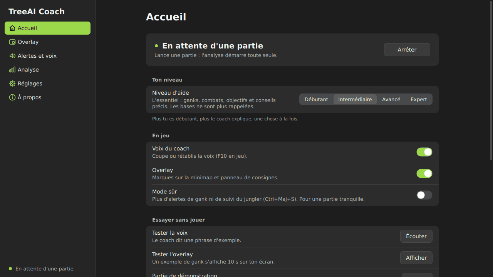
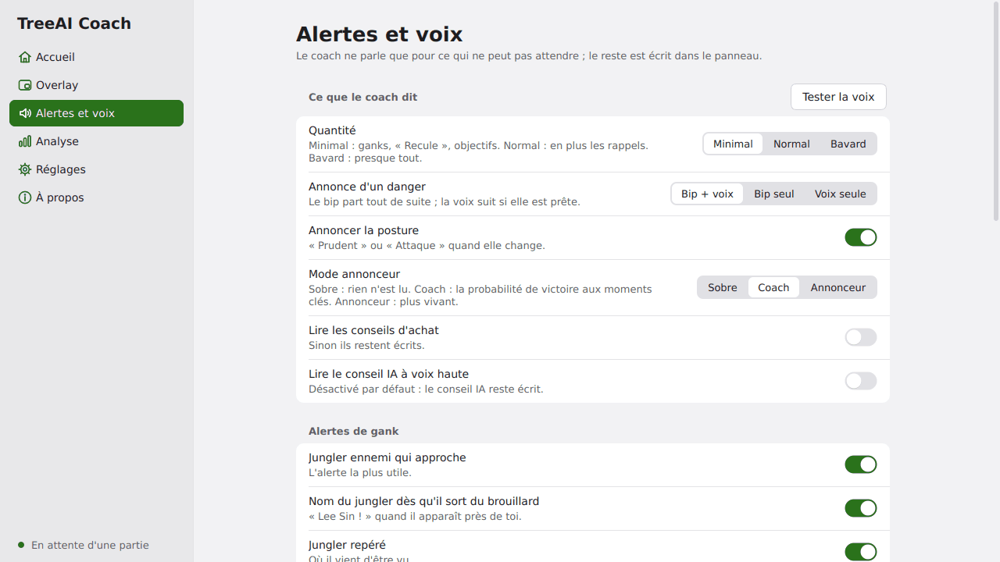
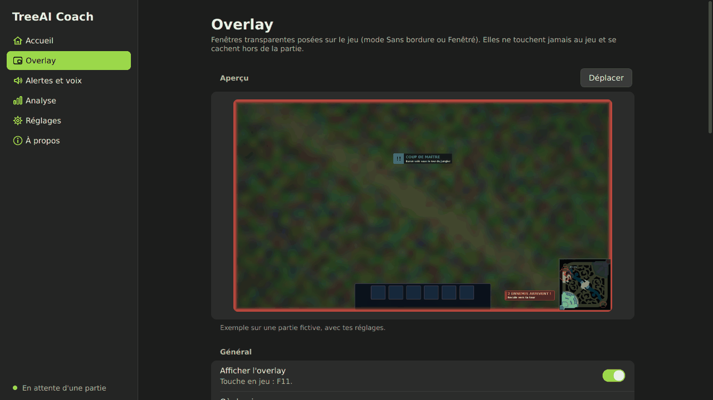
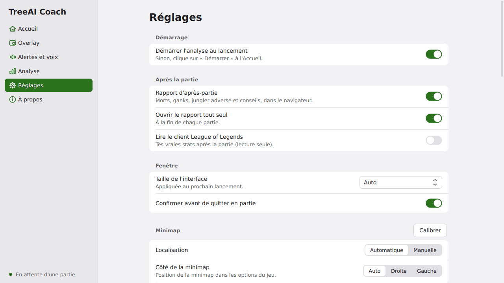

<p align="center">
  
</p>

<h1 align="center">TreeAI Coach</h1>

<p align="center">
  <b>Le coach qui regarde ta minimap pour toi.</b><br>
  Un bip dès que le jungler ennemi arrive, une seule consigne claire à côté de la minimap,<br>
  et un rapport honnête après chaque partie de League of Legends.
</p>

<p align="center">
  <a href="https://github.com/SosatLaZ/treeaicoach/raw/claude-team/brave-mendel-j8fqkf/release/TreeAICoach.exe"></a>
</p>

<p align="center">
  <sub>Windows 10 / 11 · un seul fichier, sans installation (~90 Mo) · gratuit et open source ·
  <a href="CHANGELOG.md">nouveautés</a> · <a href="release/SHA256.txt">SHA-256</a></sub>
</p>

<p align="center">
  
  
  
  <a href="LICENSE"></a>
</p>

<p align="center">
  
</p>

---

## Nouveautés de la 2.6

| | |
| --- | --- |
| **Nouveau launcher** | Refait de zéro : toutes les pages prêtes en environ 1 s, plus aucun bug de chargement, design épuré en clair et en sombre. |
| **Voix naturelle** | La voix naturelle d'abord, les noms de champions bien prononcés (Kai'Sa, K'Santé…), des sons doux à la place des bips. |
| **Overlay compact** | Environ 25 % plus petit, à la bonne taille sur chaque écran (720p à 4K, ultra-large, 16:10). |
| **Détection** | Duo empilé et caméra mieux suivis, capture rapide qui ne se coupe plus, alertes en double supprimées. |

Tout l'historique : [CHANGELOG.md](CHANGELOG.md).

## Télécharger

1. Clique sur le bouton **Télécharger** ci-dessus : tu obtiens **`TreeAICoach.exe`** (dossier
   [`release/`](release/), toujours la dernière version).
2. C'est **un seul fichier**, sans installation : mets-le où tu veux. Python n'est pas nécessaire.
   Les mises à jour se font ensuite depuis l'appli (**À propos → Mise à jour**).
3. Au premier lancement, Windows peut afficher **« Windows a protégé votre ordinateur »** (SmartScreen).
   Clique sur **Informations complémentaires**, puis sur **Exécuter quand même**.

> **Pourquoi cet avertissement ?** L'exécutable n'est pas signé numériquement : un certificat coûte plusieurs
> centaines d'euros par an. Le code source est public, et l'empreinte **SHA-256** de chaque version est dans
> [`release/SHA256.txt`](release/SHA256.txt). Pour vérifier dans PowerShell : `Get-FileHash .\TreeAICoach.exe`.

**Configuration :** Windows 10 ou 11 (64 bits), League of Legends en mode d'affichage **Sans bordure**
(ou Fenêtré), sur la Faille de l'invocateur.

## Démarrage en 3 étapes

1. **Dans League of Legends :** `Échap` → **Vidéo** → **Mode d'affichage : Sans bordure**.
   *(En plein écran, Windows ne laisse aucun programme capturer l'image du jeu.)*
2. **Double-clique sur `TreeAICoach.exe`.** L'analyse démarre toute seule et attend le début de la partie.
   Rien n'est capturé tant que tu n'es pas en jeu.
3. **Joue.** Les alertes arrivent automatiquement.

Sans partie en cours, essaie **Tester la voix**, **Tester l'overlay** et **Partie de démonstration** sur
l'**Accueil**.

## Ce que fait TreeAI Coach

**En partie**

- **Ganks annoncés tôt, bip d'abord.** Le bip part tout de suite ; la phrase (« Gank ! Lee Sin, recule ! »)
  suit seulement si elle est prête. Alerte aussi quand tu es seul contre deux, ou peu de vie face à un ennemi
  plus fort, même s'il est déjà à l'écran.
- **Une seule consigne à la fois.** À côté de la minimap, une petite carte : « Va bot : Dragon dans 0:45 »,
  « Recule : 2 contre 1 ». En rouge s'il y a un danger, et rien du tout quand il n'y a rien d'utile à dire.
- **Le jungler ennemi.** Sa dernière position et ses trajets probables quand il entre dans le brouillard.
- **Timers.** Buffs du Baron et de l'Ancien, ennemis morts (« 3 morts · 18 s »), objectifs qui te concernent.
- **Coups qui changent la partie.** Course aux niveaux, plaques quand ton adversaire disparaît, Baron après un
  combat gagné, achats ennemis, ce que tu oublies (point de compétence, potion, balises, or).
- **Voix sobre.** Seuls les dangers et les appels importants sont dits à voix haute ; le reste est écrit.

**Avant et après la partie**

- **Sélection des champions :** une carte avec ton adversaire, ses forces et ses faiblesses.
- **Rapport d'après-partie :** tes morts expliquées, les ganks subis, le vrai trajet du jungler ennemi (lu dans
  le client LoL), qui était le plus fort et quand, tes meilleurs coups et tes erreurs, façon chess.com.
- **Progression** d'une partie à l'autre dans la page **Analyse**.

**Facultatif**

- **Conseils IA** avec ta propre clé (Gemini, Groq, OpenRouter, Anthropic ou Ollama en local) : **F8** pose une
  question. Au plus 10 appels par partie ; désactivé par défaut.

<p align="center">
  
  
</p>

### Raccourcis en jeu

| Touche | Action |
| --- | --- |
| **F6** (maintenir) | Mode détaillé : carte complète, anneaux, rôles et dernières positions sur la minimap |
| **F7** | Où poser une balise ? |
| **F8** | Demander à l'IA (si configurée) |
| **F9** | Où est le jungler ? (réponse vocale) |
| **F10** | Couper / rétablir la voix |
| **F11** | Afficher / masquer l'overlay |
| **Ctrl+Maj+S** | Mode sûr (plus d'alertes de gank ni de suivi du jungler) |
| **Ctrl+F8** | Diagnostic : enregistre 60 s dans `%APPDATA%\TreeAICoach\diagnostics\` et ouvre le dossier |

Dans le launcher : **Ctrl+1 … 6** pour changer de page.

## Comment ça marche

1. **Capture d'écran uniquement.** L'appli regarde la minimap, exactement comme OBS ou Discord capturent ton
   écran, et la trouve toute seule.
2. **Détection des icônes.** Un petit réseau de neurones (ONNX, sur le processeur) repère les icônes de
   champions. Il est entraîné sur des minimaps synthétiques fabriquées à partir des textures officielles du jeu,
   puis vérifié sur de vraies parties.
3. **Identification.** L'**API officielle Live Client Data** de Riot, fournie par le jeu pendant la partie, donne
   les 10 champions, leurs équipes et leurs skins. L'appli sait ainsi qui est qui, et qui est le jungler ennemi.
4. **Analyse.** Les positions sont suivies dans le temps ; un ennemi dangereux qui se rapproche déclenche un bip,
   une phrase courte et une consigne sur la carte.

Tout est calculé **sur ton PC**. La seule connexion (facultative) télécharge les icônes des skins de la partie
et la voix naturelle.

## Sécurité et règles de Riot

**Ce que TreeAI Coach fait :** il lit les pixels déjà affichés sur ton écran et l'API officielle Live Client Data.
Ses fenêtres d'overlay sont de simples fenêtres Windows transparentes, posées au-dessus du jeu.

**Ce qu'il ne fait jamais :**

* ❌ aucune lecture ni écriture de la mémoire du jeu, aucune injection, aucun hook DirectX ;
* ❌ aucune touche ni aucun clic simulé (les raccourcis utilisent l'API Windows standard
  `RegisterHotKey`, comme Discord ou OBS ; F6 est seulement lu, jamais intercepté) ;
* ❌ aucun contournement ni aucune dissimulation vis-à-vis de Vanguard ou de l'anti-triche ;
* ❌ aucun suivi des sorts, des ultimes ou des temps de recharge ennemis.

**Soyons honnêtes :**

* TreeAI Coach **n'est ni approuvé ni soutenu par Riot Games**.
* La politique de Riot sur les applications tierces **évolue** : par exemple, depuis **mars 2025**, les
  applications qui suivent les ultimes et les temps de recharge des ennemis sont **interdites**. Riot peut juger à tout
  moment qu'un outil donne un avantage injuste.
* La **zone du jungler** et ses **trajets probables** sont les fonctions **les plus sensibles** : même si
  elles n'utilisent que ce que tu as vu à l'écran, elles estiment où se trouve un ennemi invisible. Tu peux les
  **désactiver** : **Overlay** → **Sur la minimap** → **Zone des ennemis cachés : Aucun** et **Trajets probables du
  jungler** désactivé, ou d'un coup avec le **Mode sûr** (Accueil, ou **Ctrl+Maj+S**).
* **Tu utilises TreeAI Coach à tes propres risques**, sans aucune garantie (voir la [licence](LICENSE)).

## Réglages

Le launcher a six pages, dans la barre de gauche :

| Page | Ce que tu y trouves |
| --- | --- |
| **Accueil** | L'état de l'analyse, ton niveau (Débutant … Expert), voix / overlay / mode sûr, les tests sans jouer, ta dernière partie, l'état du système |
| **Overlay** | Un aperçu sur une partie fictive, ce qui s'affiche en jeu (consigne, timers, minimap, jungler), « Déplacer » |
| **Alertes et voix** | Ce que le coach dit, bip et/ou voix pour un danger, chaque alerte de gank, sensibilité, voix, vitesse, volume, **Tester la voix** |
| **Analyse** | Tes parties, leurs rapports et ta progression |
| **Réglages** | Démarrage, rapport d'après-partie, client LoL, minimap (calibrer), performance, conseils IA, diagnostic |
| **À propos** | Version, mise à jour, nouveautés, raccourcis |

Tes réglages, journaux et rapports sont dans **`%APPDATA%\TreeAICoach`** (copie ce chemin dans la barre
d'adresse de l'Explorateur de fichiers).

<p align="center">
  
</p>

## Dépannage

| Problème | Solution |
| --- | --- |
| **Capture noire** / « passe en mode Sans bordure » | Dans LoL : `Échap` → **Vidéo** → **Mode d'affichage : Sans bordure**. |
| **Voix robotique** | La voix naturelle a besoin d'Internet. Sans connexion, l'appli prend la meilleure voix Windows : installe la voix française dans **Paramètres > Heure et langue > Voix** → *Ajouter des voix* → **Français (France)**, puis **Tester la voix**. |
| **Pas de voix du tout** | Vérifie qu'elle n'est pas coupée (**F10**) et l'interrupteur **Voix du coach** sur l'Accueil. |
| **Minimap non trouvée** | **Réglages → Minimap → Calibrer** : trace un carré autour de ta minimap. Si ta minimap est à gauche, change le côté au même endroit. |
| **L'appli ne voit pas la partie** | L'API de Riot répond seulement une fois la partie commencée, pas pendant l'écran de chargement. Seule la Faille de l'invocateur est analysée en direct (en ARAM, tu as un rapport limité aux statistiques). |
| **Overlay invisible** | Vérifie le mode **Sans bordure**, **F11** en jeu, puis **Tester l'overlay** sur l'Accueil. |
| **Antivirus : faux positif** | Les exe non signés créés avec PyInstaller sont parfois signalés à tort. Télécharge-le **uniquement** ici, compare son SHA-256, puis ajoute une exception. |
| **Alertes fausses / détection bizarre** | En partie, appuie sur **Ctrl+F8** : un diagnostic de 60 s est enregistré. Joins le `.zip` à ton signalement. |
| **Autre problème** | **Réglages → Maintenance et support → Journaux**, et joins le dernier fichier dans les [Issues](https://github.com/SosatLaZ/treeaicoach/issues). |

## Pour les développeurs

Python 3.11. Launcher en Qt (PySide6), overlay en fenêtres Win32, détection en numpy / OpenCV / ONNX Runtime.
Windows pour la voix, la capture et l'overlay ; les tests tournent aussi sous Linux.
Commandes pour PowerShell, depuis le dossier du projet :

```powershell
git clone https://github.com/SosatLaZ/treeaicoach
cd treeaicoach
py -3.11 -m venv .venv
.venv\Scripts\python -m pip install -r requirements-dev.txt

.venv\Scripts\python -m treeaicoach              # interface
.venv\Scripts\python -m treeaicoach --demo       # partie simulée
.venv\Scripts\python -m treeaicoach --selftest   # autotest (--selftest-out rapport.txt)
.venv\Scripts\python -m pytest -q                # tests (~1600, quelques minutes)
.venv\Scripts\python -m pytest -q -n auto --dist loadfile   # idem en parallèle (pytest-xdist, ~3x plus rapide)
.venv\Scripts\python -m tools.ux_replay --level all --scenario all --quiet   # juge des consignes : 0 violation
```

* À lire avant de modifier quoi que ce soit : [`docs/LESSONS.md`](docs/LESSONS.md) (règles tirées des retours
  joueurs), [`docs/DESIGN.md`](docs/DESIGN.md) (direction visuelle) ; architecture et contrats entre modules :
  [`docs/ARCHITECTURE.md`](docs/ARCHITECTURE.md) ; faits mesurés sur de vraies minimaps :
  [`docs/MINIMAP_FACTS.md`](docs/MINIMAP_FACTS.md) ; launcher : [`docs/LAUNCHER.md`](docs/LAUNCHER.md) ;
  banc de test de la détection : [`tools/README_detection_gym.md`](tools/README_detection_gym.md).
* **Entraînement du modèle** (PyTorch, hors exe) : toutes les commandes et options sont dans
  [`training/README.md`](training/README.md). En résumé :

  ```powershell
  .venv\Scripts\python -m pip install torch --index-url https://download.pytorch.org/whl/cpu
  .venv\Scripts\python -m pip install -r requirements-train.txt
  .venv\Scripts\python tools/fetch_assets.py     # ressources officielles (textures, icônes, skins)
  # puis training/train.py -> training/export_onnx.py -> training/evaluate.py
  # (le modèle ONNX est écrit dans treeaicoach/assets/model/)
  ```

* **Construire l'exe** :

  ```powershell
  .\packaging\build_exe.bat      # venv + tests + PyInstaller + autotest -> dist\TreeAICoach.exe
  # ou à la main :
  .venv\Scripts\python -m PyInstaller packaging/treeaicoach.spec --noconfirm --clean
  .venv\Scripts\python packaging/make_icon.py    # régénère packaging/icon.png et icon.ico
  ```

* **Publier** : un tag `vX.Y.Z` identique à `treeaicoach.__version__` lance la construction sur GitHub Actions
  et crée la release. Le dossier `release/` contient l'exe courant, `version.json` (lu par la mise à jour
  intégrée) et `SHA256.txt`. L'historique des versions est dans [`CHANGELOG.md`](CHANGELOG.md).

## Mentions légales

TreeAI Coach isn't endorsed by Riot Games and doesn't reflect the views or opinions of Riot Games or anyone officially involved in producing or managing Riot Games properties. Riot Games, and all associated properties are trademarks or registered trademarks of Riot Games, Inc.

*TreeAI Coach n'est pas approuvé par Riot Games et ne reflète pas les opinions de Riot Games ni de quiconque
officiellement impliqué dans la production ou la gestion des propriétés de Riot Games. Riot Games et toutes les
propriétés associées sont des marques commerciales ou des marques déposées de Riot Games, Inc.*

Le code de TreeAI Coach est distribué sous [licence MIT](LICENSE). Les textures et icônes du jeu embarquées
dans `treeaicoach/assets` restent la propriété de Riot Games.
